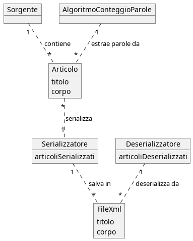

# Indice 
Il contenuto del README.md può essere visualizzato mediante maven site (organizzato meglio sul sito) con il comando `mvn site` successivamante `mvn site:run`

[Informazioni progetto](#informazioni-software)
[Guida all'installazione](#come-installare-correttamente-ed-utilizzare-il-software)
[Librerie utilizzate](#librerie-utilizzate)
[Grafici-UML]

# Informazioni Progetto

## Sistema Software
Il software verte sulla comunicazione con due sorgenti differenti: The Guardian e New York Times. Vengono scaricati ed analizzati in totale 2000 articli (1000 per sorgente). L'analisi consiste nel contare in quanti articoli compare ogni parola presente.

Di seguito viene riportata una panoramica ad alto livello delle soluzioni adottate per le funzionalità richieste.

### Gestione di eventuali nuove sorgenti
Per far si che il sistema possa supportare nuove sorgenti abbiamo sfruttato il __Facotry Pattern__ (chiamando la nostra classe `SourceFactory`). Il vantaggio è che l'introduzione di nuove sorgenti necessita solamente l'aggiunta della classe che modella la nuova sorgente e di una classe che modella gli articoli di tale sorgente. In questo modo non serve andare ad intaccare la struttura portante del progetto. Inoltre nell'implementare la `SourceFactory` abbiamo utilizzato il __Singleton Pattern__.
<br></br>
In particolar modo con il metodo `createSource()` facciamo in modo di generare la sorgente derivante dal _The Guardian_ e quella relativa al _New York Times_:
```java
public Source createSource(String sourceType, Object... args) {
     if (sourceType.equals("GuardianJsonSource") && args[0] instanceof String && args[1] instanceof String)
         return new GuardianJsonSource((String) args[0], (String) args[1]);
     else if (sourceType.equals("NewYorkTimesCsvSource") && args[0] instanceof FileReader)
         return new NewYorkTimesCsvSource((FileReader) args[0]);
     return null;
 }
```

### La persistenza su file degli articoli
In seguito alla fase di Download (fase in cui vengono creati gli oggetti `ArticleJsonGuardian` o `ArtcileCsvNYTimes`) il sistema serializza tutti gli articoli in file di formato `.xml` attraverso la classe `XmlSerializer`.  La stessa classe offre anche la possibilità di attuare il procedimento inverso, ovvero permette di deserializzare i file e creare degli oggetti che implementano l'interfaccia `Article`. La classe `XmlSerializer` di fatto implementa l'__Adapter Pattern__: abbiamo convertito l'interfaccia del serializzatore fornita dalla libreria utilizzata (`org.simpleframework.xml`) per il nostro scopo, ovvero serializzare articoli in file xml.
<br></br>
 Di seguito vengono riportati i due metodi che permettono di serializzare e deserializzare gli articoli.

```java
 public void serialize(List<? extends Article> list) {
     try {
         for(Article article : list)
             serializer.write(new ArticleXml(article.getTitle(), article.getBody()), new File(this.directory, productionCount++ + ".xml"));
     } catch (Exception e) {
        System.out.println(e.getMessage());
     }
 }
```
```java
 public List<Article> deserialize() throws Exception {
     File[] files = this.directory.listFiles((dir, name) -> name.toLowerCase().endsWith(".xml"));
     List<Article> allArticles = new ArrayList<>();

     if(files != null && files.length != 0) {
         for (File file : files) {
             allArticles.add(initializedArticle(serializer.read(ArticleXml.class, file)));
         }
         return allArticles;
     }
     else { return null; }
 }
```
### Supporto a nuove modalità di memorizzazione ed accesso agli articoli
Nel paragrafo precedente è presente la funzione che permette di serializzare gli articoli in file xml. In particolare la funzione prende in input una lista di `Article`, quindi l'unico vincolo imposto alle classi che modellano gli articoli di una sorgente è che implementino l'interfaccia `Article`. Per quanto riguarda il formato in cui il serializzatore salva i file (ovvero xml), questo aspetto non può essere cambiato o impostato. Tuttavia il serializzatore è un componente intercambiabile del sistema.
    
### Supporto nuove strutture per memorizzare ed avere accesso ai termini più importanti
Dato che il sistema deve poter supportare nuove strutture per memorizzare e poter accedere ai termini più importanti, abbiamo utilizzato lo __Strategy Pattern__. Quest'ultimo consente l'aggiunta di nuove strutture di memorizzazione e l'utilizzo di nuove tecniche algoritmiche per il conteggio delle parole in base a qualsiasi criterio. Abbiamo quindi creato l'interfaccia `WordCountStrategy`, questa deve essere implementata da tutte le strategie di conteggio. Il _context object_ è rappresentato dalla classe `WordCounter`, questo permette di settare la strategia e/o di cambiarla dinamicamente. Nel progetto abbiamo implementato la strategia `FrequencyPerArticleStrategy` che associa ad ogni termine il numero di articoli in cui appare.
```java
    public class WordCounter {

       private WordCountStrategy strategy;

       public WordCounter(WordCountStrategy strategy) {
           this.strategy = strategy;
       }

       public void setCountStrategy(WordCountStrategy strategy) {
           this.strategy = strategy;
       }

       public  List<Map.Entry<String, Integer>> count(List<Article> articles) {
           return strategy.execute(articles);
       }
   }
```

### Download articoli The Guardian tramite API
Per poter scaricare gli articoli del The Guardian attraverso chiamate alle API, abbiamo deciso di utilizzare dei comandi shell. In particolare abbiamo utilizzato la classe `ProcessBuilder` di Java per creare un processo che eseguisse il comando da noi specificato.

Il comando shell è il seguente

```bash
    echo > "<outFile>.json" && curl -o "<outFile>.json" "https://content.guardianapis.com/search?show-fields=all&page-size=200&page=<i>&api-key=<apiKey>"
```

Dove: `echo` viene utilizzato per creare il file di output in cui verrà salvata la risposta delle API; `curl` viene utilizzato per effettuare la chiamata vera e propria alle API.
Il comando viene eseguito in totale 5 volte, quindi vengono creati esattamente 5 file con all'interno 200 articoli ciascuno salvati in formato Json. Il numero di articoli che vengono scaricati non può essere settato dall'utente: ogni richiesta di download alla sorgente del The Guardian, andrà a scaricare e salvare 1000 articoli in tutto.

In fase di test del software abbiamo notato che l'esecuzione dei comandi shell costituiva un collo di bottiglia che rallentava significativamente le prestazioni. Per risolvere tale problema abbiamo deciso di parallelizzare l'esecuzione dei 5 comandi lanciando ciascuno su un thread diverso. Per farlo abbiamo utilizzato la classe `Thread` di Java.

### Algoritmo di estrazione dei termini e dei pesi associati
Abbiamo implementato una strategia (`WordCountStrategy`) di conteggio, la classe che la realizza è `FrequencyPerArticleStrategy`. L'algoritmo in pseudocodice è il seguente

```
    List<Entry<String, Integer> execute(List<Article> articles)
        if articles.isEmpty()
            return {}

        map = new Map<String, int> // salvo tutte le parole e pesi associati di tutti gli articoli

        for each article in articles
            fullText = new List<String>
            fullText.addAll(article.title().rimuoviPunteggiatura()) // aggiungo tutte le parole del titolo
            fullText.addAll(article.body().rimuoviPunteggiatura()) // aggiungo tutte le parole del corpo

            set = new Set<String>
            set.addAll(fullText) // in questo modo rimuovo le parole doppie

            for each word in set
                value = map.getValue(word) // se la parola non è presente torna 0
                map.insert(word, value+1)

        lst = new List<Entry<String, int>>
        lst.addAll(map.toList()) // inserisco tutte le entry della mappa nella lista
        lst.sortByValue() // riordino la lista in base al peso della parola

        return lst
```

### Interagire con il programma lato utente
Per permettere all'utente di specificare se eseguire il download degli articoli, l'estrazione dei termini o entrambe le azioni in sequenza, abbiamo sfruttato la libreria `org.apache.commons.cli`. In particolare:

1. L'utente può scegliere se eseguire solo il download degli articoli con il comando `-d`.
2. L'utente può decidere se effettuare l'estrazione a partire dai file dove sono stati memorizzati gli articoli tramite il comando `-e`.
3. L'utente può eseguire entrambe le operazioni in sequenza con il comando `-de`.

Ulteriori informazioni si trovano nella pagina dedicata all'installazione e uso del software.

# Come installare correttamente ed utilizzare il software

## Installazione e compilazione del progetto Maven
Per prima cosa bisogna modificare il file java `GuardianJsonSourceTest` inserendo la propria chiave api.

Successivamente, dopo essere entrati nella directory relativa al proggetto (`Progetto_Ids`), per creare il file jar e compilare il codice, è necessario digitare da terminale il seguente comando:
```terminal
mvn package
```
__NOTA__: I file jar verranno creati in automatico da Maven nella directory `Progetto_Ids/target`.
In particolare verranno create
- `progetto-1.0-SNAPSHOT.jar`
- `progetto-1.0-SNAPSHOT-jar-with-dependencies.jar`

Inoltre verrà generata la cartella `output` che inizialmente dopo la compilazione conterrà solo quelli relativi ai test del proegetto.

## Generare Javadoc
Per generare i javadocs

    mvn javadoc:javadoc

## Mavensite
Abbiamo creato la cartella `Progetto_Ids/src/site` che contiene i file sorgenti per creare il sito.
Le istruzioni necessarie per creare e rendere accessibile il sito sono:

    mvn site
    mvn site:run

Il sito sarà quindi disponibile al seguente indirizzo: [http://localhost:8080/](http://localhost:8080/)

Inoltre per generare l'output relativo ai test tramite il plug-in `surefire-report` nella cartella `Proggetto_Ids/target/site` dopo aver compilato i test, è necessaria la digitazione del seguente comando:
```terminal
mvn test
mvn surefire-report:report
```
## Esecuzione del programma
Per eseguire il programma sono possibili diversi comandi prompt sotto elencati:

```terminal 
 usage: App -{d,e,de,h} [OPTION]...
 -ak,--api-key <arg>       Set the guardian API
 -csv,--csv-input <arg>    Set new york times .csv file input path
 -d,--download             Dowload all articles form all the sources
 -de,--download-extract    Download and extract terms
 -h,--help                 Print this help message
 -o,--output <arg>         Set results output file path          
 -xml,--xml-output <arg>   Set xml files input path (deserialize from) or output path (serialize in)
```

###  Download ed estrazione

In particolar modo l'utente può richiedere di effettuare solo il download con il comando:
```terminal
java -cp ./target/progetto-1.0-SNAPSHOT-jar-with-dependencies.jar it.unipd.dei.eis.App -ak <API-KEY> -d
```
In seguito può richiedere di effettuare l'estrazione e dunque procedere con la fase di deserializzazione e avviare l'algoritmo di conteggio specifico delle parole con il comando:
```terminal
java -cp ./target/progetto-1.0-SNAPSHOT-jar-with-dependencies.jar it.unipd.dei.eis.App -e
```
In alternativa a questi due comandi si può scegliere l'azione unica tramite:
```terminal
java -cp ./target/progetto-1.0-SNAPSHOT-jar-with-dependencies.jar it.unipd.dei.eis.App -ak <API-KEY> -de
```
Dopo aver eseguito il programma i file generati verranno inseriti nella cartella `output` che conterrà a sua volta le sottocartelle
`outputJsonTheGuardian` e `outputXml`. La prima conterrà i file risposta delle chiamate API del _The Guardian_, la seconda cartella conterrà tutti i file __JSON__ e __CSV__ nel formato standard `.xml`.
Il risultato del conteggio si troverà in `output/results.txt'.


### Comandi extra

Il parametro `-xml` può essere aggiunto nella fase di download per specificare la cartella in cui inserire i file serializzati degli articoli. In alternativa può essere utilizzato nella fase di estrazione per impostare la cartella da cui deserializzare gli articoli:
```terminal
java -cp ./target/progetto-1.0-SNAPSHOT-jar-with-dependencies.jar it.unipd.dei.eis.App -xml <Path> -d
```
Infine con il parametro `-csv` si può importare un ulteriore file csv del New York Times che sia però compatibile con gli header prefissati:
```terminal
java -cp ./target/progetto-1.0-SNAPSHOT-jar-with-dependencies.jar it.unipd.dei.eis.App -csv <Path> -d
```

# Librerie utilizzate 

## Dipendenze
| Nome        | Versione    | Usata per   |
| ----------- | ----------- | ----------- |
| `curl`| _qualsiasi_  | interagire con API del The Guardan |
| `junit`|  version : 4.12  | automatizzare i test |
| `com.fasterxml.jackson.core` | 2.8.8.1 | leggere e scrivere da/in file JSON) |
| `org.apache.commons` | 1.10.0 | leggere file CSV) |
| `org.simpleframework` | 2.7.1 | leggere e scrivere file XML |
| `commons-cli` | 1.5.0 | gestire opzioni specificate da linea di comando |

# Grafici UML

## Use case


<br></br>
<br></br>


## Domain model


## Diagramma di classe


## Diagramma di attività


## Diagramma di sequenza

